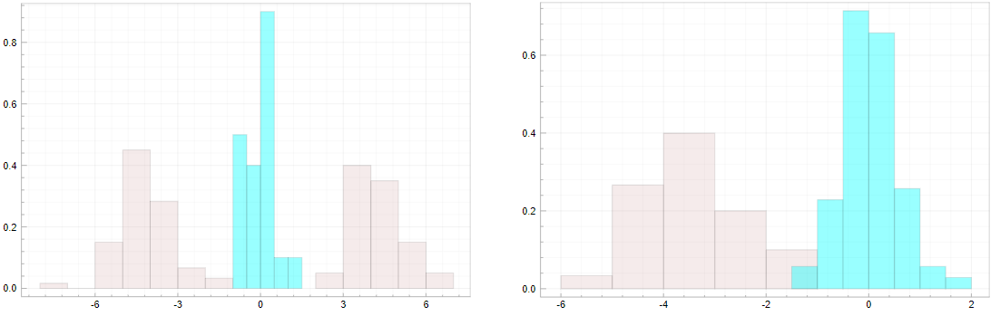
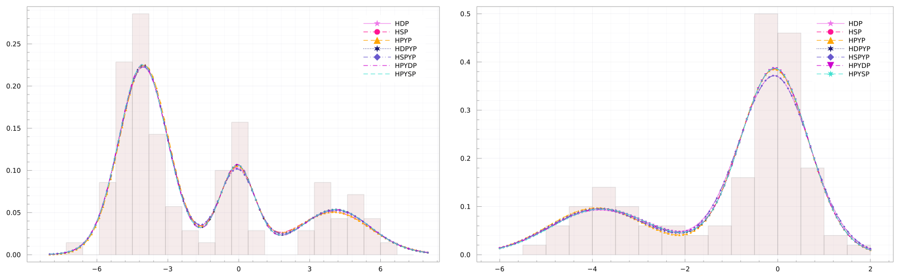
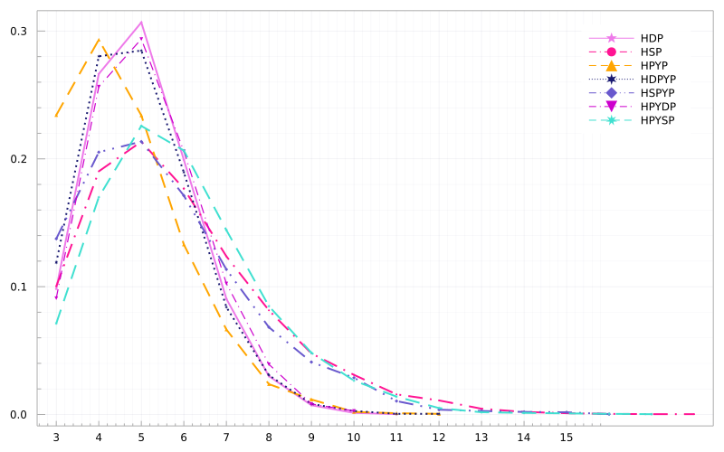
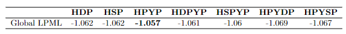

# Mixtures for partially exchangeable data
## HNRMIs as prior distributions of mixture models
Hierarchical normalized random measures with independent increments (HNRMIs) can be used as prior distributions for the components of a mixture model.  Assume that 

$$
\begin{align*}
(\mathrm{y}_{i,j})\_{i=1}^{n_i} \text{ for }i=1,\ldots, m
\end{align*}
$$

are presumably partially exchangeable. Given an unobserved parameter $\mathrm{x}\_{i,j}$, the data generating mechanism is

$$ 
  \begin{equation*}
\begin{split}
     \mathrm{y}\_{i,j} \, | \, \mathrm{x}\_{i,j} &\stackrel{\text{ind}}{\sim} \mathcal{K}(\, \cdot \, | \, \mathrm{x}\_{i,j}) \quad j=1,\ldots, n_i, \, i=1,\ldots, m \\
    \mathrm{x}\_{i,j} \, | \, \tilde{p}_i &\sim \text{NRMI}(\rho, \theta, \tilde{p}_0) \\
    \tilde{p}_0 &\sim \text{NRMI}(\rho_0, \theta_0, P_0),
\end{split}
\end{equation*} 
$$

where $\mathcal{K}$ is a suitable kernel density. 
By using the chinese restaurant franchise sampler, described in X Y W, we can build a Gibbs sampler that subsequently samples the 'local' mixture component of each point $(\mathrm{y}_{i,j})\_{i=1}^{n_i}$ of each of the $m$ groups, and then 'global' component overall. 

## Toy example
In the above model, assume that 
$\mathcal{K}$
is a Gaussian kernel with random mean and variance and that, to achieve conjugacy, the base measure 
$P_0$
is a normal-inverse gamma distribution. To compare and asses each model's adequacy, we will use the LPML as a measure of the goodness of fit. The parameters of the prior processes were chosen in such a way that, marginally, 
$\mathbb{E}[K\_{i,100}]=5$
 for $i=1,2$ 
 and, globally, 
 $\mathbb{E}[K_{200}]=6$. 
 For more details on how the hyperparameters of $P_0$ were chosen consult the full text at Appendix C. 
 
 We simulated 200 data points from the mixtures

$$
\begin{align*}
\mathrm{y}\_{1,j} &\sim 0.6\mathrm{N}(-4, 1) + 0.2 \mathrm{N}(0, 0.5) + 0.2\mathrm{N}(3.5, 1.25)\quad j=1,\ldots, 100 \\
    \mathrm{y}\_{2,j} &\sim 0.7\mathrm{N}(0, 0.5) + 0.3 \mathrm{N}(-3.5, 1) \quad j=1,\ldots, 100 
\end{align*}
$$

The common component is shown in blue. 

The goal of the sampler is to fit density estimations on both groups whilst the algorithm recognizes the blue companent as shared in the two groups.

The fitted densities are shown in the next picture. The acronyms mean respectively: hierarchical Dirichlet process (HDP), hierarchical stable process (HSP), hierarchical Pitman-Yor process (HPYP), hierarchical Dirichlet Pitman-Yor process (HDPYP), hierarchical stable Pitman-Yor process (HSPYP), hierarchical Pitman-Yor Dirichlet process (HPYDP) and hierarchical Pitman-Yor stable process (HPYSP). 

All processes capture well the 3 and 2 modes in both data groups. The posterior distribution of the number of components in each group is shown in the next figure. 

Most of the prior processes place high probability to number significantly close to the true number of components, that is three and two for group one and group two respectively. The behavior of the HPYP resembles more to the one of the HSP process rather than the HDP, as in both 
$\mathrm{K}_{1,100}$
and 
$\mathrm{K}_{2,100}$
it tends to use more components than any other model.

Finally, the posterior distribution of the global number of components $K_0$ is shown next. 

We see that all processes give high probability to numbers close to four, which is the true number of global components from which the data was sampled, however only the HPYP place the mode exactly at four. The rest of the models tend to give higher probability to larger values of 
$\mathrm{K}_{200}$
, meaning that these models use more components to estimate the densities. Particularly, the inclusion of a stable process at any level of the hierarchy leads to more platykurtic distributions as opposed to the inclusion of a Dirichlet process, which produces more leptokurtic distributions. Clearly the distribution of the global number of components involves smaller values than the sum of the marginal number of components, <b> indicating that all the hierarchical prior processes considered allow for various degrees of information pooling across the two different groups</b>. 

The LPML ($10^3$) is shown in the next table. All processes have a similar level of accuracy.

